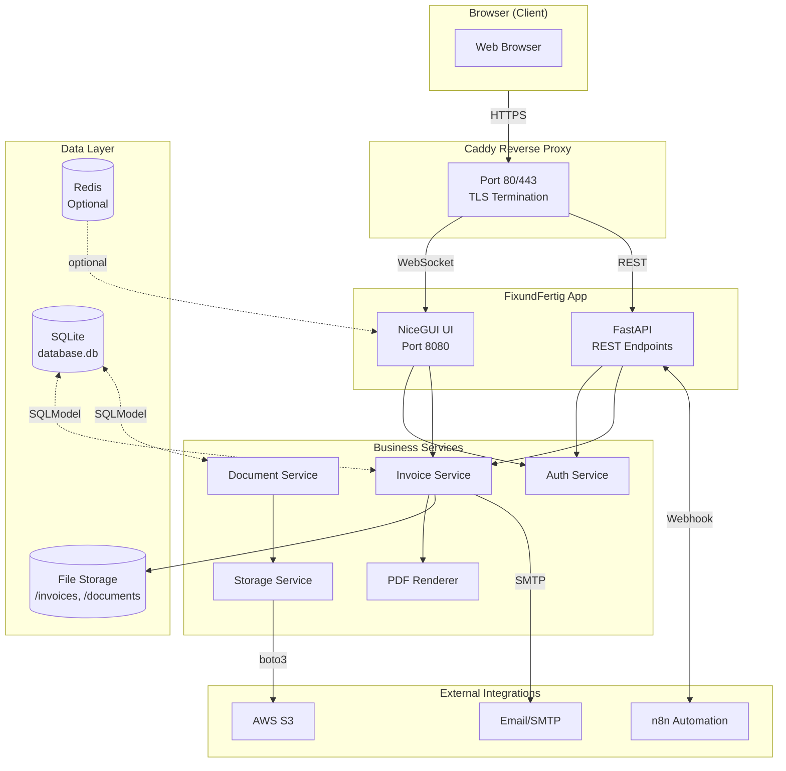
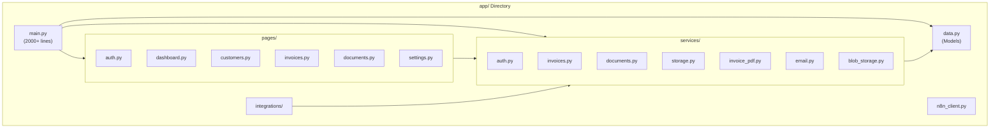
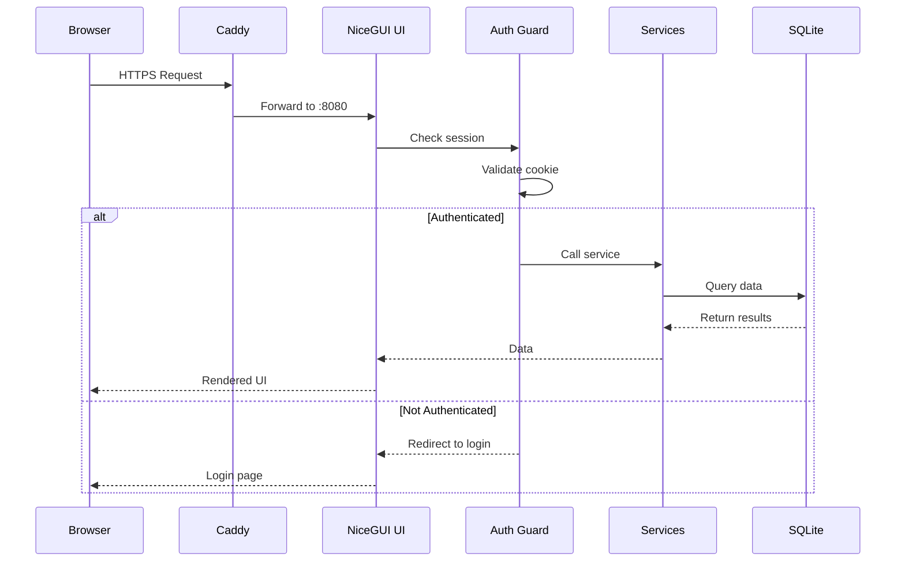
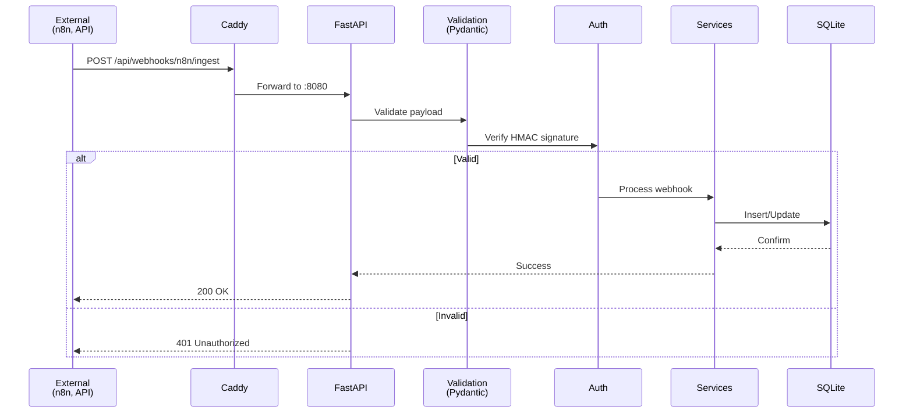
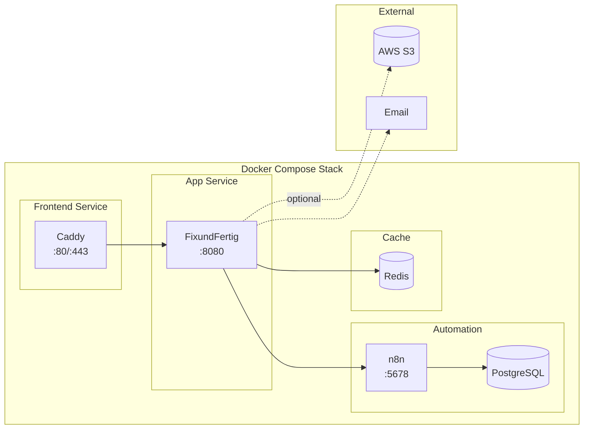
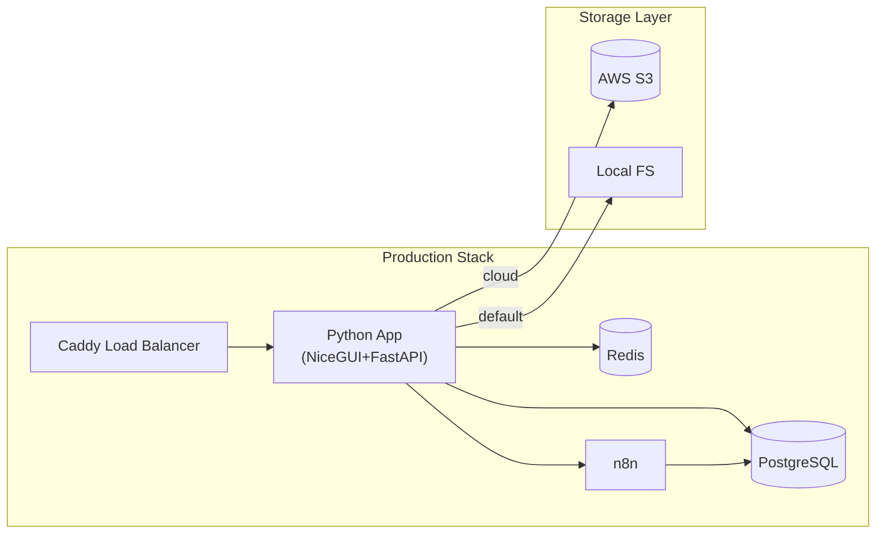
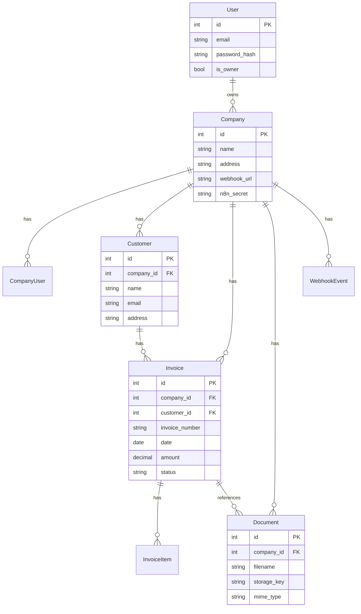
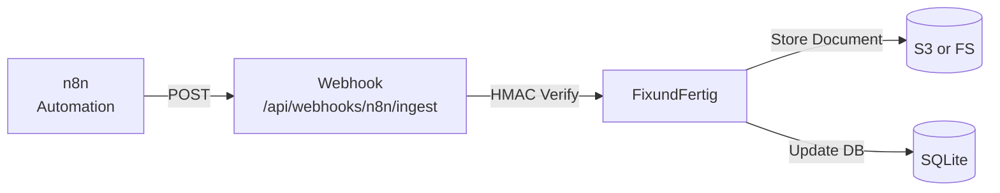
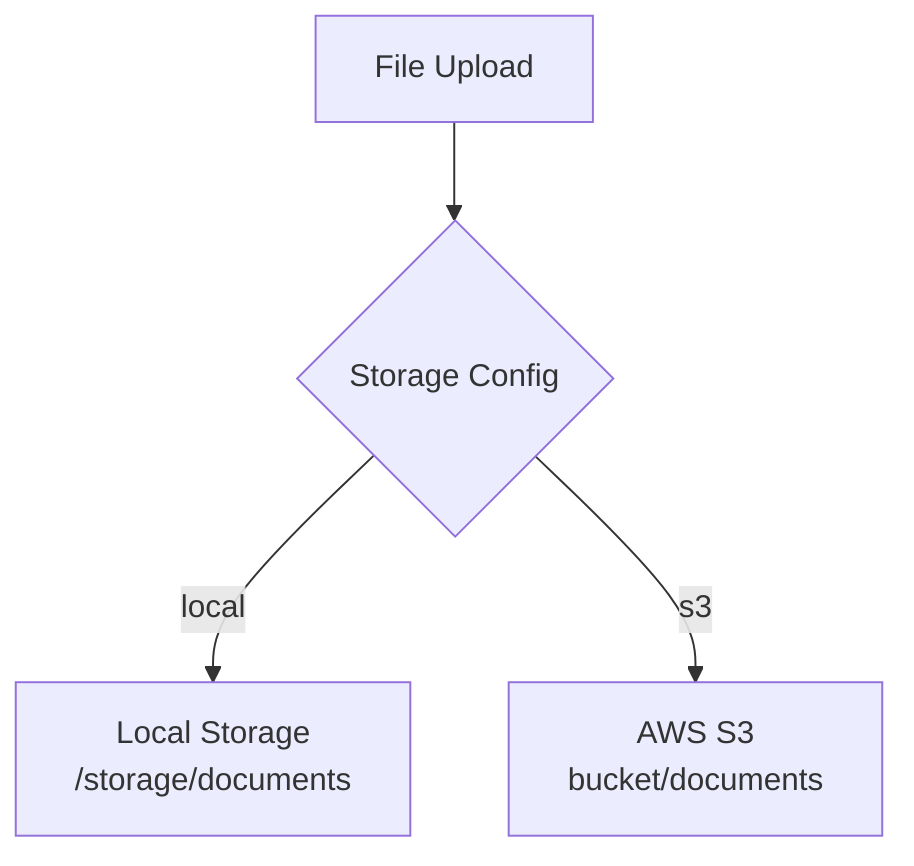
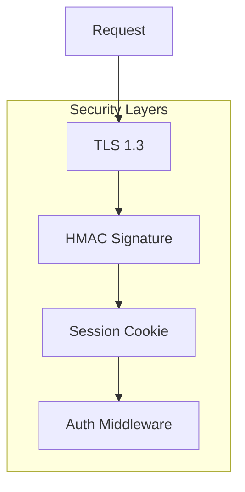

# FixundFertig Architecture Full Rundown

**Analysis Date:** 2026-05-05

---

## System Overview

FixundFertig is a German invoicing/ERP SaaS platform built with Python, NiceGUI, and FastAPI. It provides complete invoice management with document ingestion, customer management, PDF generation, and webhook integrations.

---

## High-Level Architecture

---

## Application Structure

---

## Request Flow: Browser → UI

---

## Request Flow: External API

---

## Server Integration Architecture

---

## Deployment Configuration

---

## Database Schema Overview

---

## Technology Stack

| Component | Technology | Version |
|-----------|-----------|---------|
| **Web Framework** | NiceGUI + FastAPI | Python 3.11+ |
| **Database** | SQLite (default) / PostgreSQL (prod) | SQLModel ORM |
| **PDF Generation** | ReportLab, fpdf2 | Latest |
| **Authentication** | Custom session + HMAC | bcrypt, passlib |
| **Storage** | Local filesystem, AWS S3 | boto3 |
| **Automation** | n8n | Latest |
| **Proxy** | Caddy 2 | Latest |
| **Runtime** | Docker, uvicorn | Latest |

---

## Key Integration Points

### n8n Integration

### S3 Blob Storage

---

## Component Responsibilities

| Component | File | Responsibility |
|-----------|------|-------------|
| `main.py` | `app/main.py` | FastAPI app, routing, middleware |
| `data.py` | `app/data.py` | SQLModel entities |
| `pages/*` | `app/pages/*.py` | NiceGUI UI renderers |
| `services/*` | `app/services/*.py` | Business logic |
| `renderer.py` | `app/renderer.py` | PDF generation |
| `n8n_client.py` | `app/integrations/n8n_client.py` | n8n webhook client |

---

## Environment Variables

### Required
- `OWNER_EMAIL` - Initial owner account
- `OWNER_PASSWORD` - Initial owner password
- `APP_DOMAIN` - Production domain
- `STORAGE_SECRET` - Session signing secret (32+ chars)

### Optional
- `REDIS_URL` - Redis caching
- `N8N_SECRET` - n8n integration
- `AWS_*` - S3 credentials
- `SMTP_*` - Email settings

---

## Security Architecture

---

*Full architecture rundown: 2026-05-05*